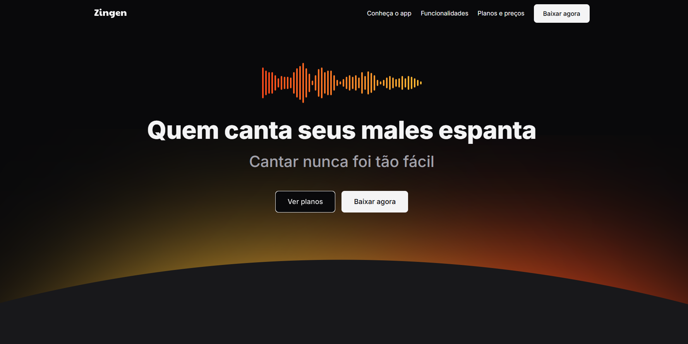
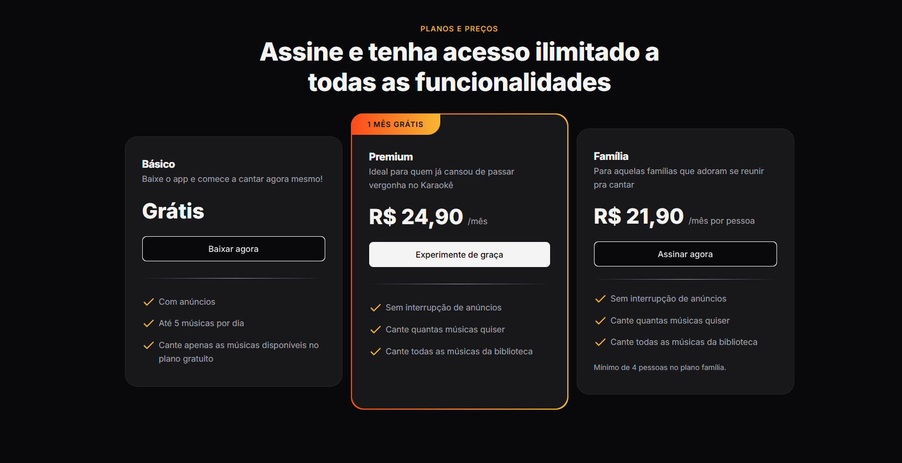

# 🎤 Zingen - Karaokê

> Landing Page responsiva para o aplicativo de karaokê Zingen

## 📋 Sobre o Projeto

Zingen é uma landing page moderna e responsiva desenvolvida para promover um aplicativo de karaokê inovador. O projeto apresenta uma interface elegante que destaca as principais funcionalidades do app, incluindo IA para remoção de voz, experiência gamificada e biblioteca musical extensa.

## ✨ Funcionalidades

- 🎯 Design responsivo para todos os dispositivos
- 🎨 Interface moderna e intuitiva
- 📱 Seções organizadas (Hero, Sobre, Funcionalidades, Preços, Download)
- 🎵 Apresentação das funcionalidades do app de karaokê
- 💰 Planos de assinatura (Básico, Premium, Família)
- 📲 Links para download nas lojas de aplicativos

## 🚀 Tecnologias

- **HTML5** - Estrutura semântica
- **CSS3** - Estilização e responsividade
- **Google Fonts** - Tipografia (Inter)

## 🎨 Layout

O projeto conta com:
- Header com navegação
- Seção hero com call-to-action
- Apresentação do aplicativo
- Cards de funcionalidades
- Planos de preços
- Seção de download
- Footer completo

## 🚀 Como usar

1. Clone o repositório
2. Abra o arquivo `index.html` no navegador
3. Navegue pela landing page

## 📱 Responsividade

O projeto é totalmente responsivo, adaptando-se a:
- 📱 Dispositivos móveis
- 💻 Tablets
- 🖥️ Desktops

---
